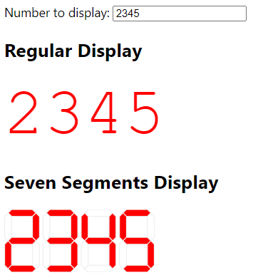

# Seven Segments Display

## Introduction

Angular 16 sample demonstrating:

* Standalone components
* Signals...
  * Basics
  * ... together with inputs

## How to use the sample

* Discuss fundamentals of seven segment displays.
  * Show [SVG](https://codepen.io/Rainer-Stropek/pen/bGORpXo)
* Create the app, repeat the steps necessary for that
  * Discuss concept of standalone components
* Build display out of regular numbers
  * Discuss the concept of signals
* Build the seven segment display based on previous exercises
* Build the cash register
  * Discuss `update` of signals
  * Discuss CSS grids

## Homework

### Level 1

We currently have a discount on apples. Buy more than 5 apples and get 10% discount
on all apples you buy. The discount must be visible as a separate line item in the
cash register.

### Level 2

Make the `SevenSegmentNumberComponent` more flexible by accepting an input parameter
for the number of digits to display.

Note: A sample solution for this level can be found in [*seven-segment-number-level2*](./src/app/seven-segment-number-level2/)

### Level 3

Make the `SevenSegmentNumberComponent` support a decimal point. The number of
decimal places can be fixed or - if you want an extra challenge - can be configurable via an input parameter.

Note: A sample solution for this level can be found in [*seven-segment-number-level3*](./src/app/seven-segment-number-level3/)

### Level 4

Create a `SixteenSegmentTextComponent` with a [16 segment text display](https://en.wikipedia.org/wiki/File:Sixteen-segment_display_field.svg) (e.g. [sample image](https://powerusers.microsoft.com/t5/image/serverpage/image-id/341762iFCD10BF07C0147AD/image-size/medium/is-moderation-mode/true?v=v2&px=400)).

Note: I do not offer a sample solution for this level. This is your job, dear students 😉. You can send me a pull request if you managed to solve this level.
