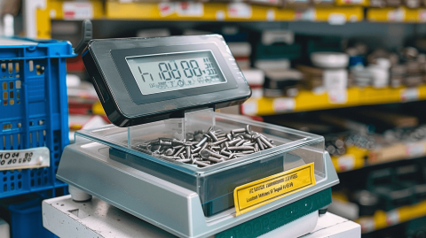

# WPF Exercise: Screw Order

## Introduction

You work in a home improvement store. Customers can buy screws in packs of 100 or by weight. Write a program that calculates the number of packs a customer buys.

## Screw Data

| Type of screw | kg per 100 screws | Price per 100 screws |
| ------------- | ----------------: | -------------------: |
| M4, 6mm       |             0.133 |                1,35€ |
| M4, 8mm       |             0.149 |                1,40€ |
| M5, 6mm       |             0.218 |                1,65€ |
| M5, 8mm       |             0.238 |                1,80€ |

## Specification

This exercise consists of three parts. Make sure to implement them in the order given below. Complete each part before you start with the next one.

### Part 1: UI Design

Design and implement a WPF application with the following features:

- Users can add order items (screws) to an order list.
  - Use a [data grid](https://learn.microsoft.com/en-us/dotnet/desktop/wpf/controls/datagrid) to display the order list. Entering data does not need to happen in the data grid, it can be done in separate text boxes and buttons. However, if you like, you can also implement inline editing in the data grid.
  - Type of screw must be a dropdown list (options see table above)
  - Per order item, users can enter the quantity in either packs of 100 or in kg.
- Users can enter their personal data (name, city, zip code, street, house number).
- Users can press a _Save_ button to save the entire order list to the database. After saving, the UI is reset to its initial state.

Think about how to design the UI. Create a WPF application and implement the UI design using XAML. As a first step, ignore the business logic. Focus on the XAML UI only.

Tips:

- Before your write any XAML code, draw a sketch of your UI on paper or using a UI design tool like [Figma](https://www.figma.com/) or [Adobe XD](https://helpx.adobe.com/support/xd.html).
- If you struggle with the data grid, take a look at e.g. the [data grid from the _Taxi Manager_ lecture](https://github.com/rstropek/htl-2023-24-5th/blob/5a14fdd587aa22ed3a7499fa08ea8a32428de344/samples/2024-03-taxi-manager/Solution/TaxiManager/MainWindow.xaml#L41).

### Part 2: Business Logic

Implement the following business logic:

- Adding an order item to the list is only possible if the user has entered a quantity that results in _at least one pack of 100 screws_. If the user enters a quantity or a weight that is too low, adding the order item must not be possible.
- Saving is only possible if...
  - ...the order list is not empty.
  - ...the user has entered their personal data (all fields are mandatory)
- If the user enters the quantity in kg, the program must convert it to the number of packs of 100 according to the table above, and vice versa. Round the number of packs to the nearest integer (round up at `>= .5`, round down at `< .5`). Round the weight in kg to two decimal places.
- The program must calculate the price of each order item and display it in the list. Round the price to two decimal places.
- The program must calculate the total price of all order items and display it. The total price is the sum of all _rounded_ prices.

Implement a view model that contains the specified business logic. Use data binding to connect the view model to the XAML view. Use command bindings for buttons.

Tips:

- Use the [`DelegateCommand`](https://github.com/rstropek/htl-2023-24-5th/blob/main/samples/9050-product-hierarchy/solution/ProductHierarchy/DelegateCommand.cs) as discussed in the last lecture.
- If you struggle, take a look at the [view model from the last lecture](https://github.com/rstropek/htl-2023-24-5th/blob/main/samples/9050-product-hierarchy/solution/ProductHierarchy/MainWindowViewModel.cs).
- If you want to conditionally display UI elements, remember the [`BooleanToVisibilityConverter` class](https://learn.microsoft.com/en-us/dotnet/api/system.windows.controls.booleantovisibilityconverter) that we discussed in one of the WPF lectures.
- As a first step, store the data _only in-memory_. Database access is done in the next step.

### Part 3: Database Access

Create a data access layer with which you can save the orders to a SQL Server database. Use Entity Framework Core for this. The database must contain the following tables:

Tips:

- Use the [DB context factory](https://github.com/rstropek/htl-2023-24-5th/blob/e3d8b450db9d8632295fb303d09dbbb374a5a1d8/samples/9050-product-hierarchy/solution/ProductHierarchy.Data/ProductionDataContext.cs#L44) from the last lecture.
- Use [dependency injection](https://github.com/rstropek/htl-2023-24-5th/blob/e3d8b450db9d8632295fb303d09dbbb374a5a1d8/samples/9050-product-hierarchy/solution/ProductHierarchy/App.xaml.cs#L14) as demonstrated in the last lecture.

## Test Data

| Type of screw | Entered number of packages |   kg | Calculated number of packages | Price |
| ------------- | -------------------------: | ---: | ----------------------------: | ----: |
| M4, 6mm       |                          3 |  N/A |                           N/A | 4.05€ |
| M4, 8mm       |                        N/A | 0.75 |                             5 | 7.00€ |
| M5, 6mm       |                        N/A | 0.86 |                             4 | 6.60€ |

Total costs: 17.65€
