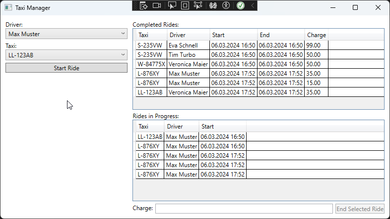

# Taxi Manager

## Introduction

This sample implements a _Taxi Manager_ application. It offers the following functionality:

* Maintain a list of Taxi cars
* Maintain a list of Taxi drivers
* Maintain a list of Taxi rides
    * A ride can be active (_ongoing_), i.e. the car is currently occupied by a passenger
    * A ride can be finished (_completed_), i.e. the ride as an end time and a fare (_charge_)

Technically, the project is a WPF application with an underlying SQL Server database. Entity Framework Core is used to access the database. The WPF application follows the MVVM pattern.

## Database

To save you some time, the data model is already defined in [_Model.cs_](./Starter/TaxiManager/Data/Model.cs). The project also has all necessary NuGet packages installed. A rudimentary database context is available in [_DataContext.cs_](./Starter/Data/DataContext.cs). You have to complete the methods in the data context that currently throw a `NotImplementedException`. The requirements for the methods are described in the code comments.

You can fill the database with demo data using the [_DemoDataCreationScript.sql_](./DemoDataCreationScript.sql).

Don't forget to adjust the connection string in [_appsettings.json_](./Starter/TaxiManager/appsettings.json) to match your local SQL Server instance.

## WPF

The structure of the WPF application is already set up. The main window is in [_MainWindow.xaml_](./Starter/TaxiManager/MainWindow.xaml). The view model is in [_MainWindowViewModel.cs_](./Starter/TaxiManager/MainWindowViewModel.cs). The view model is already connected to the view using the `DataContext` property.

Complete the [_MainWindowViewModel.cs_](./Starter/TaxiManager/MainWindowViewModel.cs) as specified in the code comments.

Add the necessary XAML data bindings to the [_MainWindow.xaml_](./Starter/TaxiManager/MainWindow.xaml) as specified in the code comments.

## Unit Tests

Use the unit tests in [_TaxiManager.Tests_](./Starter/TaxiManager.Tests/) to verify your implementation.
