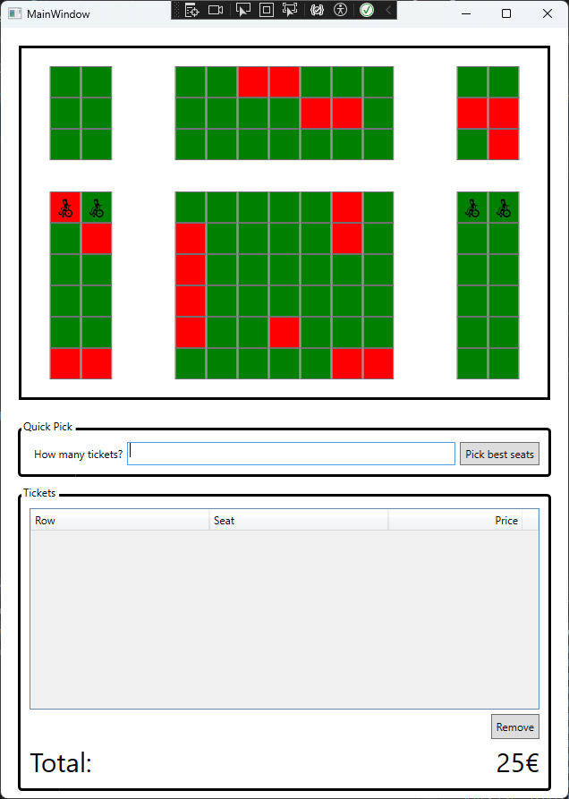

# Cinema Seat Plan



## Introduction

A friend of yours runs a small city cinema. She asks you to build a simple app with which she can put together seats for incoming parties.

## Starter Code

You find the starter code in [_Seats_](./Seats/). Look through the code. The requirements are in the comments. Look particularly for comments marked with `TODO`.

## Non-Functional Requirements

This example is WPF-only. You do not need to add Entity Framework or any other database. In the last exam, you have already proven that you can work with databases. In this example, we want to focus on WPF completely.

## Algorithmic Challenge

### Level 1

When the user clicks on the button _Pick best seats_, the application must choose the first row of seats (starting from the last row, moving forward row by row) that has enough seats for the given number of tickets. The seats must be adjacent to each other (no aisle between them). If no such row exists, display an alert (`MessageBox.Show`) with an error message. If such a row exists, the seats must be selected as if the user would have clicked on them manually.

Example: The following seat plan is available. `O` means the seat is available, `X` means the seat is taken.

```txt
    Seat
R   12  34567  89
1   XO  XXXOO  OO
2   OO  OOOOO  OO
3   OO  OOXXO  OO
4   OO  XXXXX  OO
```

If a user wants 4 tickets, the application should select seats in row 2. If a user wants 2 tickets, the application should select seats in row 4.

### Level 2

If you want a slightly more complex challenge, change the logic from _level 1_ as follows: If there isn't a block of adjacent seats available, it is ok to pick one where the block is split by an aisle.

In the above example, the application should select seats in row 3 if the user wants 4 tickets.

### Level 3

If you want an even more complex challenge, change the logic from _level 2_ as follows: If you have multiple options in the best row, pick the one where the sum of the distances of all seats from the middle of the row is the smallest. The distance calculation must take aisles into account.
